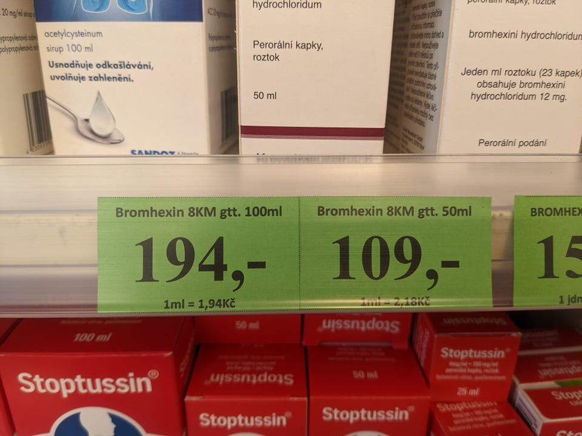

# Label maker - tvorba cenovek

> Tento projek je součástí navazujícího kurzu [pyladies Plzeň](https://pyladies.cz/plzen/).
> Možnosti vstupu, výstupu a chování aplikace je popsáno v [zadání](task.md).

## Popis projektu

Program, který usnadňuje práci při tvorbě cenovek v lékárně.

Uživatel zadá potřebné hodnoty, výsupem je pak tisknutelný soubor připravený k rozstříhání.



---

## Instalace

Momentálně je aplikace ve formě spustitelného python scriptu. Je tak potřeba mýt nainstalovaný python ve verzi 3.6 a
větší.  
Pro instalaci je také doporučeno použít virtuální prostředí, například vestavěné `venv`.

Instalaci pythonu ověříte v příkazové řádce pomocí příkzu: `where.exe python`.

Poté v příkazové řádce instalujte pomocí následujících příkazů:

```commandline
git clone https://github.com/pyladies-pilsen/label-maker
cd label-maker
python -m venv venv
venv\Scripts\activate
pip install -r requirements.txt
```

## Spuštění

> Poznámka: Momentálně aplikace neumožňuje zadat cestu k csv souboru pomocí argumentu v příkazové řádce.

Požadovaný soubor nahrajte do složky `input`.  
Csv soubor musí obsahovat text v dvojitých uvozovkách, čísla bez uvozovek (příklad pro tři cedulky):

```text
"name","form","unit","quantity","total_price"
"Bepanthen Seneiderm","crm","g",50,363
"Enzycol DNA","tbl","ks",140,765
"PantheHair šampon","sol","ml",200,124
```

Ve složce aplikace (`label-maker`) pak spusťte následující příkazy:

```commandline
venv/Scripts/activate
python label_maker.py
```

Výstupní soubor s cedulkami pak najdete ve složce `output`.

> Poznámka: aplikace v současné chvíli produkuje jen výstupní soubor docx


